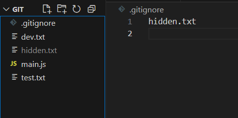

## *how to remove the branches locally and remotely.*
- locally
if the branch is merged : git branch -d test
if not merged: git branch -D test
- remotely
:git push origin --delete test
..................
## Annotated tags vs Lightweight Tags 
they used as reference to a commit and both used to mark a point in the history of the repo but differ in metadata
- Annotated tags:
 a full Git object stored in the git database it includes metadata like the tagger’s name, email, date, and a custom message, along with a reference to a specific commit
- lightweight tags
 simple pointer to a specific commit, with no additional metadata
 ..........
 # what is git rebase
is to change the history of a branch's commits that will make it appear as it came after the main branch's commit
.....
# How to list tags? 
using "git tag"
......
# How to delete tag locally and remotely? 
- locally
git tag -d v1.7
- remotely
git push origin --delete refs/tags/v1.7
...........
# photo and hidding a file
